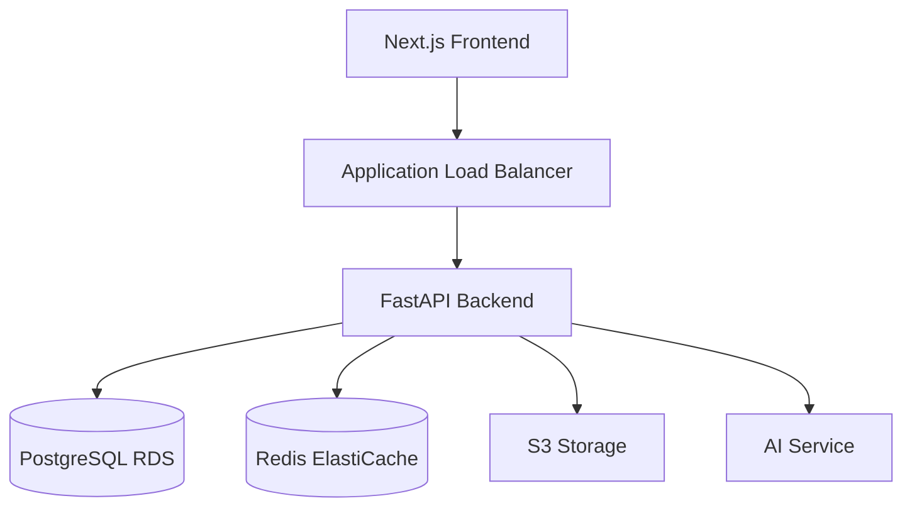

# Maily Architecture

## Overview

Maily is a modern AI-powered email marketing platform built with a microservices architecture. This document outlines the key architectural decisions and their rationales.

## System Architecture

## Architecture Decision Records (ADRs)

### ADR 1: Microservices Architecture
**Date**: 2024-02-24

**Status**: Accepted

**Context**:
- Need for scalability and independent service deployment
- Different components have different scaling needs
- Team structure supports multiple service ownership

**Decision**:
- Adopt microservices architecture
- Use containerization with Docker
- Deploy on AWS ECS/Fargate

**Consequences**:
- (+) Independent scaling and deployment
- (+) Technology flexibility per service
- (-) Increased operational complexity
- (-) Need for service discovery and orchestration

### ADR 2: FastAPI for Backend
**Date**: 2024-02-24

**Status**: Accepted

**Context**:
- Need for high-performance API
- Modern Python async support required
- Strong typing and validation needed

**Decision**:
- Use FastAPI as the backend framework
- Implement OpenAPI/Swagger documentation
- Use Pydantic for data validation

**Consequences**:
- (+) Excellent performance and async support
- (+) Automatic API documentation
- (+) Type safety and validation
- (-) Learning curve for team

### ADR 3: Next.js for Frontend
**Date**: 2024-02-24

**Status**: Accepted

**Context**:
- Need for SEO optimization
- Server-side rendering requirements
- Modern React features needed

**Decision**:
- Use Next.js for the frontend
- Implement SSR where needed
- Use TypeScript for type safety

**Consequences**:
- (+) Better SEO capabilities
- (+) Improved performance
- (+) Modern development experience
- (-) More complex build process

### ADR 4: Data Storage Strategy
**Date**: 2024-02-24

**Status**: Accepted

**Context**:
- Need for both relational and cache storage
- High availability requirements
- Data consistency important

**Decision**:
- Use PostgreSQL (AWS RDS) for persistent storage
- Use Redis for caching and session management
- Implement multi-region replication

**Consequences**:
- (+) Strong data consistency
- (+) High availability
- (+) Efficient caching
- (-) Higher operational costs

### ADR 5: AI Integration Architecture
**Date**: 2024-02-24

**Status**: Accepted

**Context**:
- Need to integrate multiple AI models
- Performance requirements for AI operations
- Cost optimization needed

**Decision**:
- Implement adapter pattern for AI models
- Use Redis for caching AI responses
- Implement rate limiting and cost controls

**Consequences**:
- (+) Flexible AI model integration
- (+) Optimized performance
- (+) Cost control
- (-) More complex integration logic

## Performance Considerations

### Database
- Connection pooling
- Query optimization
- Indexing strategy
- Read replicas for scaling

### Caching
- Multi-level caching strategy
- Cache invalidation policies
- Redis cluster configuration
- Cache hit ratio monitoring

### API
- Rate limiting
- Request size limits
- Response compression
- Connection pooling

## Security Architecture

### Authentication
- JWT-based authentication
- API key management
- OAuth2 integration
- Rate limiting per user

### Data Protection
- Data encryption at rest
- TLS for data in transit
- Key rotation policies
- Backup encryption

### Network Security
- VPC configuration
- Security groups
- WAF rules
- DDoS protection

## Monitoring and Observability

### Metrics
- Prometheus metrics
- Custom business metrics
- SLO/SLA monitoring
- Cost metrics

### Logging
- Centralized logging
- Log retention policies
- Error tracking
- Audit logging

### Alerting
- Alert thresholds
- On-call rotation
- Incident response
- Automated remediation

## Deployment Strategy

### CI/CD
- GitHub Actions workflows
- Automated testing
- Infrastructure as Code
- Blue-green deployments

### Environment Management
- Development
- Staging
- Production
- Disaster recovery

## Future Considerations

### Scalability
- Horizontal scaling
- Database sharding
- CDN integration
- Edge computing

### Feature Roadmap
- A/B testing infrastructure
- Machine learning pipeline
- Real-time analytics
- Multi-tenant support 