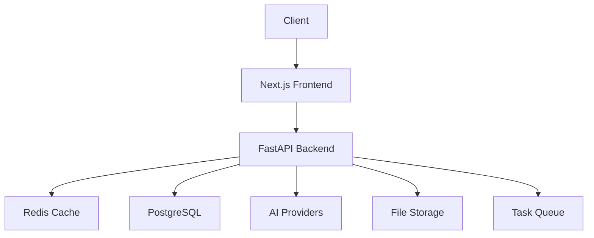

# Welcome to Maily Documentation

Maily is a modern, AI-powered email campaign platform that helps you create, design, and optimize your email campaigns using cutting-edge artificial intelligence.

## Key Features

### 🤖 AI-Powered Content Generation
- Multiple AI provider support (OpenAI, Anthropic, Google, etc.)
- Smart content suggestions
- Personalization at scale
- A/B testing optimization

### 📊 Analytics & Monitoring
- Real-time campaign analytics
- Performance monitoring
- Prometheus metrics integration
- Grafana dashboards

### 🔒 Enterprise Security
- Rate limiting
- CORS protection
- API key authentication
- Secure data encryption

### 💾 Robust Infrastructure
- Redis caching
- PostgreSQL database
- Distributed computing with Ray
- Cross-region replication

### 📈 Scalability
- Horizontal scaling support
- Load balancing ready
- Automated backups
- Disaster recovery procedures

## Quick Links

- [Installation Guide](getting-started/installation.md)
- [API Documentation](api/endpoints.md)
- [Contributing Guidelines](development/contributing.md)
- [Security Best Practices](operations/security.md)

## System Architecture

## Getting Started

1. [Install the platform](getting-started/installation.md)
2. [Configure your environment](getting-started/configuration.md)
3. [Create your first campaign](getting-started/quick-start.md)

## Support

Need help? Check out our:

- [API Reference](api/endpoints.md)
- [Troubleshooting Guide](operations/troubleshooting.md)
- [GitHub Issues](https://github.com/yourusername/maily/issues)

## Contributing

We welcome contributions! Please see our [Contributing Guidelines](development/contributing.md) for details. 