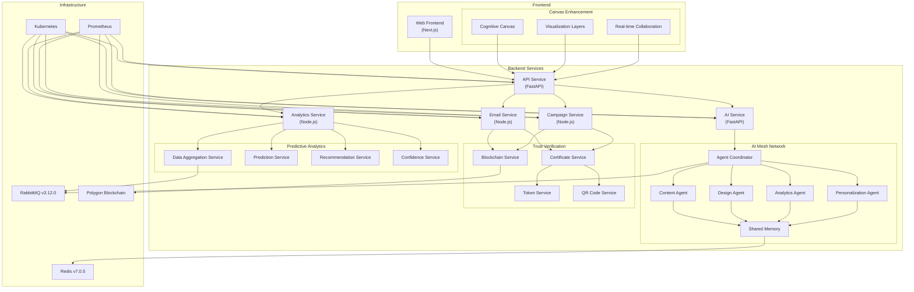
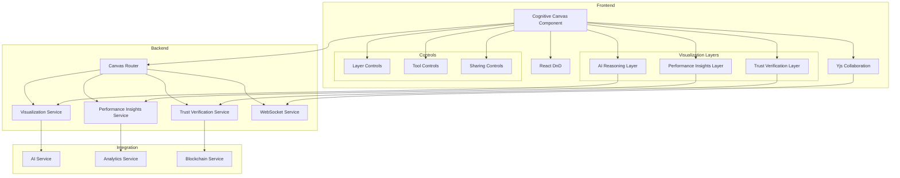
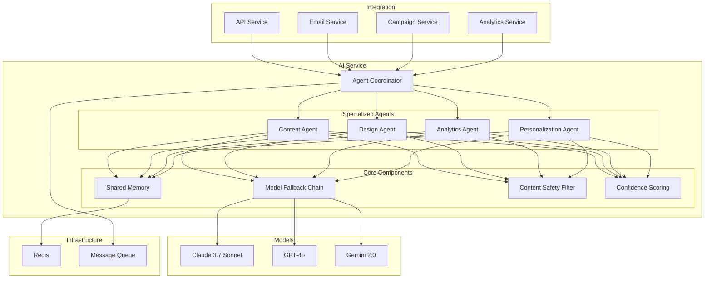
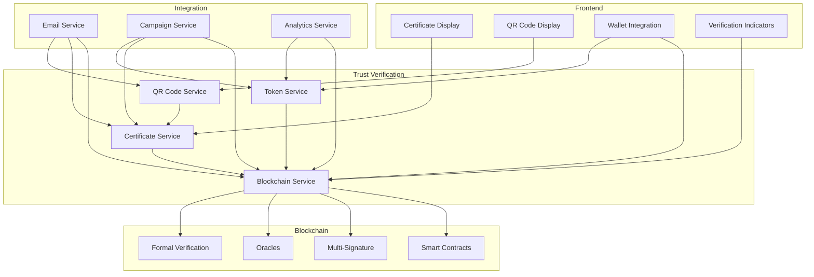
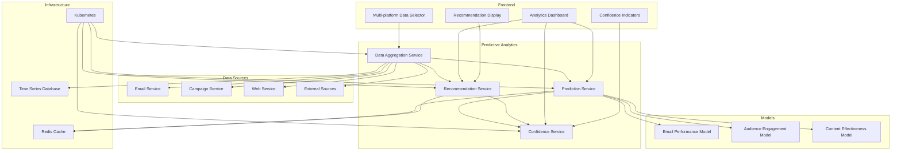

# Architecture Diagram

## High-Level Architecture

## Cognitive Canvas Architecture

## AI Mesh Network Architecture

## Interactive Trust Verification Architecture

## Predictive Analytics Fusion Architecture

